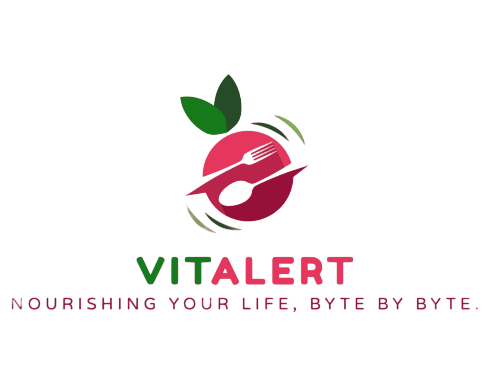

  

## About Our Project

**94% Of Canadians are deficient in one or more nutrients.** [(1)](https://www.ncbi.nlm.nih.gov/pmc/articles/PMC8408873/)

"VitAlert" is a web application designed to help individuals maintain a balanced diet by tracking their daily food intake. Developed during the 24-hour NWHacks 2024 hackathon.
Our inspiration stems from the growing prevalence of nutrient deficiencies, impacting overall health and well-being. 
In a world where busy schedules often lead to suboptimal dietary choices, "Vitalert" is a solution that empowers users to make informed decisions about their nutrition.
Our mission is to bridge the gap between dietary habits and optimal health by providing actionable insights tailored to individual needs.
Unlike generic nutrition apps, "Vitalert" goes beyond tracking; it actively identifies nutrient deficiencies and suggests personalized dietary adjustments.
We believe in not just monitoring but guiding users toward a healthier lifestyle.

## Features
* Personalized nutrient tracking
* Actionable insights for informed nutrition choices
* User-friendly interface for seamless experience

## Visit Our Website
Explore VitAlert at https://nw-hackers.web.app/ or https://vitalert.tech/.

## Getting Started
1. Clone the repository: `git clone https://github.com/CallumMackenzie/nwhacks2024`
2. Navigate to the project directory: `cd nwhacks2024`
3. Install dependencies: `npm install`
4. Configure API keys: Add your Edamam API keys to the configuration file.
5. Run the application: `npm start`

## User Stories
User Registration and Login: 
* As a user, I want to be able to create an account and log in to the nutrient tracking website so that I can save and access my food intake data.

Inputting Daily Food Intake:
* As a user, I want to be able to input the foods I eat daily, specifying the quantity, so that the application can track my nutrient intake.

Viewing Nutrient Information:
* As a user, I want to see a summary of the nutrients I have consumed based on the foods I entered, so that I can be aware of my nutritional intake.

Identifying Missing Nutrients:
* As a user, I want the application to identify and display any missing nutrients in my daily intake compared to recommended values, so that I can address nutritional gaps.

Receiving Food Suggestions:
* As a user, I want the application to suggest specific foods that can help me fulfill the missing nutrients in my diet, so that I can make informed choices about what to eat.

Editing and Deleting Entries:
* As a user, I want to be able to edit or delete entries in my food intake log, in case I make a mistake or want to update the information.

## Copyright Information
Copyright © 2024 Callum Mackenzie, Fegico Chen, Terence Yin, Hieu Le
